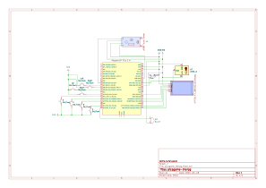

# Picogame RPG
A turn based rpg implemeting sensors for special attacks on a pico 2w.

:::info 

**Author**: Denis-Iulian Pavel \
**GitHub Project Link**: https://github.com/UPB-PMRust-Students/project-denis-iulian-pavel

:::

## Description

My project will be a game coded completely in rust designed to run on a Pico 2W with 4 buttons (A, B, Special and Menu), a joystick for navigation, a tft screen, with sensors for special attacks (such as a light sensor or proximity sensor)

## Motivation

I chose this project because I decided to implement a multiple features and utilize all aspects I've studied up until now in the lab, in rust on a microprocessor like the Pico 2W. 

## Architecture 

Raspberry Pi Pico 2W to:
- RGB_TFT LCD Screen 128x160
- A, B, Special, Start buttons
- Left, Right and Up, Down buttons
- Buzzer
- Temperature Sensor
- Vibration Sensor
- Touch Sensor

## Log

<!-- write your progress here every week -->

### Week 5 - 11 May

Established main board connections. Connected debugger, main board, a b c d buttons, screen and buzzer.
Wrote code to initialize and test functionality for these.
Wrote a script to display chroma keyed sprites on the screen so I can use background images and one to play sounds for the buzzer.

### Week 12 - 18 May

Purchased sensors. Scrapped joystick and replaced with buttons.
Established connections between the rest of the components.

### Week 19 - 25 May

## Hardware

Raspberry Pi Pico 2W, Buttons, Screen (rgb_tft 128x160), Temperature Sensor, Touch Sensor, Vibration Sensor.

### Schematics

### Bill of Materials

| Device | Usage | Price |
|--------|--------|-------|
|[Raspberry Pi Pico 2W](https://www.raspberrypi.com/products/raspberry-pi-pico-2/)|The main controller|[39.66 RON](https://www.optimusdigital.ro/ro/placi-raspberry-pi/13327-raspberry-pi-pico-2-w.html?search_query=pico+2w&results=33)|
|Electronic Components Kit|Basic Components|[15.63 RON (SALE)](https://www.aliexpress.com/item/1005007636611675.html?spm=a2g0o.order_list.order_list_main.5.3bab1802f07p9F)|
|1.8-inch SPI TFT Module LCD Display|Screen|[15.45 RON (SALE)](https://www.aliexpress.com/item/1005007174990368.html?spm=a2g0o.order_list.order_list_main.10.3bab1802f07p9F)|
|Breadboard HQ (830 Puncte)|Extra Breadboard|9.98 RON (DELISTED)|
|Vibration Sensor SW-18020P|Earthquake attack|[1.29 RON](https://www.optimusdigital.ro/ro/senzori-de-vibraii/13038-senzor-de-vibratii-sw-18020p.html)|
|[LM35D Analog Temperature Sensor](https://www.optimusdigital.ro/en/index.php?controller=attachment&id_attachment=1448)|Randomization elements|[4.99 RON](https://www.optimusdigital.ro/en/sensors/1469-lm35d-analog-temperature-sensor-to-92.html)|
|Touch Sensor LM393|Touch Attack|[4.99 RON](https://www.optimusdigital.ro/ro/senzori-senzori-de-atingere/12986-senzor-de-atingere-lm393.html)|
|Total Cost|Full price for the hardware|91.99 RON|

## Software

| Library | Description | Usage |
|---------|-------------|-------|
| [tinybmp](https://crates.io/crates/tinybmp)                             | BMP image decoder for embedded environments    | To decode BMP image files                        |
| [embedded-text](https://crates.io/crates/embedded-text)                 | Text rendering library for embedded-graphics   | For rendering text on embedded graphics displays |
| [embassy-embedded-hal](https://github.com/embassy-rs/embassy)           | Embedded HAL utilities with async support      | Peripheral abstraction layer with async support  |
| [embassy-sync](https://github.com/embassy-rs/embassy)                   | Synchronization primitives and data structures | Async-aware synchronization and data sharing     |
| [embassy-executor](https://github.com/embassy-rs/embassy)               | Async/await executor for embedded systems      | Task executor with interrupt and thread support  |
| [embassy-futures](https://github.com/embassy-rs/embassy)                | Utilities for working with futures in no\_std  | Lightweight futures utilities without alloc      |
| [embassy-time](https://github.com/embassy-rs/embassy)                   | Timekeeping and delays                         | Delays, timeouts, and scheduling                 |
| [embassy-rp](https://github.com/embassy-rs/embassy)                     | RP2040 HAL (Hardware Abstraction Layer)        | Support for Raspberry Pi RP2040 microcontrollers |
| [embassy-usb](https://github.com/embassy-rs/embassy)                    | USB device support                             | Async USB device stack                           |
| [fixed](https://crates.io/crates/fixed)                                 | Fixed-point number library                     | Fixed-point math operations                      |
| [fixed-macro](https://crates.io/crates/fixed-macro)                     | Macros for fixed-point numbers                 | Convenient fixed-point literals                  |
| [serde](https://crates.io/crates/serde)                                 | Serialization/deserialization framework        | JSON and data serialization                      |
| [serde-json-core](https://crates.io/crates/serde-json-core)             | JSON support for no\_std environments          | JSON parsing/serialization in embedded systems   |
| [cortex-m-rt](https://crates.io/crates/cortex-m-rt)                     | Cortex-M runtime support                       | Startup and runtime support for Cortex-M         |
| [embedded-graphics](https://crates.io/crates/embedded-graphics)         | 2D graphics library for embedded systems       | Drawing graphics on embedded displays            |
| [display-interface-spi](https://crates.io/crates/display-interface-spi) | SPI interface for display drivers              | Communicate with SPI-based displays              |
| [display-interface](https://crates.io/crates/display-interface)         | Display interface abstractions                 | Abstraction for display communication            |
| [mipidsi](https://crates.io/crates/mipidsi)                             | Generic MIPI-DSI display driver                | Driver for TFT displays                          |
| [heapless](https://crates.io/crates/heapless)                           | Heapless data structures                       | Fixed-capacity data structures                   |
| [embedded-hal](https://crates.io/crates/embedded-hal)                   | Hardware abstraction layer                     | Blocking hardware interface traits               |
| [embedded-hal-async](https://crates.io/crates/embedded-hal-async)       | Async embedded HAL traits                      | Async hardware interface traits                  |
| [embedded-hal-bus](https://crates.io/crates/embedded-hal-bus)           | Bus sharing utilities                          | Utilities for sharing SPI/I2C buses              |
| [embedded-io-async](https://crates.io/crates/embedded-io-async)         | Async IO traits                                | Async read/write traits for embedded systems     |
| [static-cell](https://crates.io/crates/static-cell)                     | Statically allocated runtime cell              | Safe static initialization                       |
| [embedded-storage](https://crates.io/crates/embedded-storage)           | Storage trait definitions                      | Traits for non-volatile storage                  |
| [rand](https://crates.io/crates/rand)                                   | Random number generation                       | RNG utilities                                    |
| [byte-slice-cast](https://crates.io/crates/byte-slice-cast)             | Safely cast byte slices                        | Type-safe byte slice casting                     |
