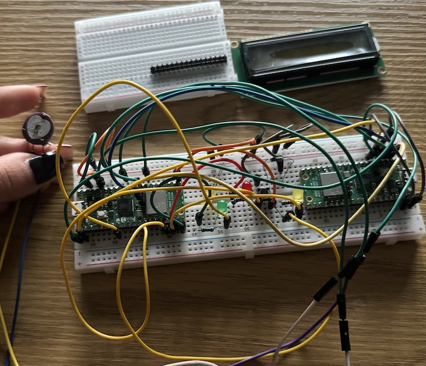
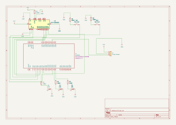

# Lie Detector  
*A portable lie detector that uses heart rate signals to detect stress or deception.*

:::info  
 **Author:** Macesanu Miruna-Andreea \ 
 **GitHub Project Link:** (https://github.com/UPB-PMRust-Students/project-mmirudeea.git) 
:::

## Description  
This project is a **portable lie detector** that analyzes **heart rate variability (HRV)** to detect signs of stress or deception. It uses a **pulse sensor** to capture heart rate signals, processes the data using a **Raspberry Pi Pico 2** running Rust, and displays the result in real time.  

The device provides feedback in three ways:  
- Displays the result on an **LCD screen**  
- Lights up an LED:  
  - 🟥 **Red** = Lie  
  - 🟨 **Yellow** = Unsure  
  - 🟩 **Green** = Truth  
- Sends session data over **USB serial** for logging or analysis  

A **push button** starts each detection session manually, making the device interactive and easy to use.

---

## Motivation  
I chose this project because I’ve always been interested in how technology can interpret signals from the human body. The idea of detecting stress or deception by analyzing heart rate variability felt like a meaningful challenge that connects both **biology** and **technology** — two areas I find fascinating.  

At the same time, this project gave me the opportunity to deepen my skills in **embedded Rust programming**, work with **real-time signal processing**, and design an interactive system that gives immediate feedback. It’s rewarding to build something that not only works technically but also helps visualize how small changes in the body can reflect emotional states. I see this as a step toward future projects where technology can be used to better understand or respond to human behavior.

---

## Architecture

### Schematic Diagram

### Main Architecture Components  
- **Sensor Interface Layer**  
  Captures analog signals from the pulse sensor via the Pico’s ADC.  

- **Signal Processing & Detection Logic**  
  - Filters and processes the heart rate signal.  
  - Uses algorithms (e.g., HRV analysis) to detect stress or deception.  
  - Decides the result: "Lie", "Unsure", or "Truth".  

- **User Interface Layer**  
  - Displays the detection result on the OLED screen.  
  - Controls the LEDs to give visual feedback (Red, Yellow, Green).  
  - Monitors the push button to start sessions.  

- **Communication Layer**  
  Sends processed data and session results over USB serial using `usbd-serial`.

---

### Connections Between Components  
- **Sensor Interface Layer → Signal Processing & Detection Logic**  
  (Heart rate data is read and processed.)  

- **Signal Processing & Detection Logic → User Interface Layer**  
  (Detection result is displayed on OLED and indicated with LEDs.)  

- **Signal Processing & Detection Logic → Communication Layer**  
  (Session data is transmitted over USB serial.)  

- **User Input (Start Button) → Signal Processing & Detection Logic**  
  (Triggers the start of a new detection session.)

---

## Log

### Week 5 - 11 May
I  bought the necessary components and started assembling them on the breadboard, except for the LCD screen, which still needs the pins soldered in the next lab session. I also configured a Raspberry Pi Pico 2W to be used as a debugger. I tested with a simple code to check if the LEDs,the pulse sensor and the button work correctly and are connected properly.

### Week 12 - 18 May
Connected all hardware components and started initial code development

### Week 19 - 25 May

## Hardware

The device is built around the Raspberry Pi Pico 2W microcontroller, which serves as the brain of the system. It reads physiological signals from a Pulse Sensor XD-58C for heart rate monitoring. The detection results are shown in real-time on an LCD ecru display and indicated visually through three LEDs (Red for lie, Yellow for unsure, Green for truth).

A tactile push button allows the user to manually start each detection session. All components are connected using a breadboard, jumper wires, and pin headers for prototyping. Basic electronic components like resistors are used for signal conditioning and LED current limiting.

### Schematics

### Bill of Materials

| Device                      | Usage                          | Price   |
| --------------------------- | ------------------------------ | ------- |
| [Raspberry Pi Pico 2W (x2)](https://www.raspberrypi.com/documentation/microcontrollers/pico-series.html)   | Microcontroller + debug        | [79.32 RON](https://www.optimusdigital.ro/en/raspberry-pi-boards/13327-raspberry-pi-pico-2-w.html?search_query=raspberry+pi+pico+2w&results=36) |
| [Pulse Sensor XD-58C](https://www.optimusdigital.ro/ro/senzori-altele/1273-senzor-de-puls-xd-58c.html?gad_source=1&gbraid=0AAAAADv-p3CzfCB_qO9d_GcEdCkbc89MZ&gclid=EAIaIQobChMIqaL495eIjQMVn4toCR1sDhl8EAAYASAAEgKKePD_BwE)         | Measures heart rate            | [15.17 RON](https://www.optimusdigital.ro/ro/senzori-altele/1273-senzor-de-puls-xd-58c.html?gad_source=1&gbraid=0AAAAADv-p3CzfCB_qO9d_GcEdCkbc89MZ&gclid=EAIaIQobChMIqaL495eIjQMVn4toCR1sDhl8EAAYASAAEgKKePD_BwE) |
| [LCD](https://www.optimusdigital.ro/ro/optoelectronice-lcd-uri/2894-lcd-cu-interfata-i2c-si-backlight-albastru.html?search_query=lcd+&results=217)                    | Display readings               |[ 16 RON](https://www.optimusdigital.ro/ro/optoelectronice-lcd-uri/2894-lcd-cu-interfata-i2c-si-backlight-albastru.html?search_query=lcd+&results=217)   |
| [Red LED](https://www.optimusdigital.ro/ro/kituri-optimus-digital/9517-set-de-led-uri-asortate-de-5-mm-si-3-mm-310-buc-cu-rezistoare-bonus.html?search_query=led+kit&results=70)                     | Lie indicator                  | ~1 RON   |
| [Yellow LED](https://www.optimusdigital.ro/ro/kituri-optimus-digital/9517-set-de-led-uri-asortate-de-5-mm-si-3-mm-310-buc-cu-rezistoare-bonus.html?search_query=led+kit&results=70)                  | Uncertain indicator            | ~1 RON   |
| [Green LED](https://www.optimusdigital.ro/ro/kituri-optimus-digital/9517-set-de-led-uri-asortate-de-5-mm-si-3-mm-310-buc-cu-rezistoare-bonus.html?search_query=led+kit&results=70)                   | Truth indicator                | ~1 RON   |
| [Resistors (220–330Ω, assorted)](https://www.optimusdigital.ro/ro/componente-electronice-rezistoare/10928-plusivo-kit-250-buc-rezistoare.html?search_query=Plusivo+Kit+250+buc+Rezistoare&results=3) | Current limiting            | 14.99 RON |
| [Pull-down resistor (10kΩ)](https://www.optimusdigital.ro/ro/componente-electronice-rezistoare/10928-plusivo-kit-250-buc-rezistoare.html?search_query=Plusivo+Kit+250+buc+Rezistoare&results=3)   | Stabilize button input         | Included |
| [Breadboard (830 points)](https://massgadgets.com/produs/breadboard-placa-tip-830-puncte/?gad_source=1&gbraid=0AAAAApd2z2YoiQ1hKj0vVxCIeTMxwxL76&gclid=EAIaIQobChMIlaWH0ZmIjQMVh52DBx2UIDEWEAQYASABEgIUh_D_BwE)     | Prototyping                    | 9.98 RON |
| [Header de pini (40p x4)](https://www.optimusdigital.ro/ro/componente-electronice-headere-de-pini/463-header-de-pini-alb-254-mm-40p.html?search_query=Header+de+pini+%2840p%29&results=22)     | Connect components             | 3.96 RON |
| [Tactile Push Button (x3)](https://www.optimusdigital.ro/ro/butoane-i-comutatoare/1119-buton-6x6x6.html?search_query=Buton+6x6x6&results=1)    | User input                     | 1.08 RON |
| [Jumper Wires](https://www.optimusdigital.ro/ro/fire-fire-mufate/12-set-de-cabluri-pentru-breadboard.html?search_query=Set+Fire+pentru+Breadboard&results=37)                | Connections                    | ~7 RON   |

## Software

| Library         | Description                  | Usage                                  |
| --------------- | ---------------------------- | -------------------------------------- |
| `embassy-rs`    | Async embedded framework     | For async tasks and timing             |
| `embedded-hal`  | Hardware abstraction layer   | Standard traits for sensors, LEDs      |
| `ssd1306`       | Display driver               | Displaying text and graphics           |
| `usbd-serial`   | USB serial communication     | For debugging and data logging         |
| `gpio`          | General-purpose I/O          | LED and button control                 |
| `panic-halt`    | Panic handler                | For halting on panic                   |
| `cortex-m`      | Cortex-M support crate       | Low-level ARM operations               |

## Links

